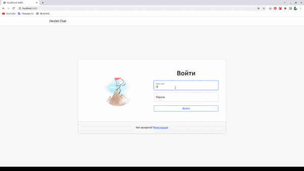

### Hexlet tests and linter status:
[](https://github.com/Aleksandr-Bondarev/frontend-project-lvl4/actions)
[](https://github.com/Aleksandr-Bondarev/frontend-project-lvl4/actions/workflows/NodeCI.yml)

# [Chat (Slack like)]((https://alex-bond-slack.herokuapp.com/))
### Simple real-time chat application. 

## Features:

    - Instant messaging
    - Two default chat channels (#general & #random)
    - Custom chat channels can be deleted or renamed
    - Error or success notifications by [react-toastify](https://www.npmjs.com/package/react-toastify)
    - Profanity filter by [leo-profanity](https://www.npmjs.com/package/leo-profanity)
    
## Installation:

    ```
    $ make install
    ```
## Run App:

    ```
    $ make start
    then open http://localhost:5000/
    ```
## App Demo:

[Deployment of app to Heroku](https://alex-bond-slack.herokuapp.com/)

